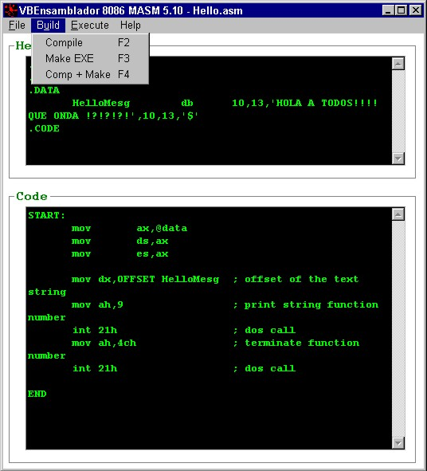

<div align="center">

## VBAssembler \(uploaded again\)


</div>

### Description

VBAssembler -> Automated Edit Assembler with VB. Sorry I uploaded again because i got some errors.
 
### More Info
 
(For Assembler programmers with MASM 5.10) This is just an automated edit assembler with VB. Now You can create, edit, save, compile, make EXE and execute your assembler codes (.ASM)

See help for more information.

Sorry about standars and Control names, originally the whole project was in spanish (I'm from Mexico) but i changed comments and menu for a better understanding. ^_^ \/

Generates OBJ & EXE files from assembly code

none that i know


<span>             |<span>
---                |---
**Submitted On**   |2001-12-19 12:26:00
**By**             |[L124RD K1N6](https://github.com/Planet-Source-Code/PSCIndex/blob/master/ByAuthor/l124rd-k1n6.md)
**Level**          |Advanced
**User Rating**    |5.0 (15 globes from 3 users)
**Compatibility**  |VB 5\.0
**Category**       |[Miscellaneous](https://github.com/Planet-Source-Code/PSCIndex/blob/master/ByCategory/miscellaneous__1-1.md)
**World**          |[Visual Basic](https://github.com/Planet-Source-Code/PSCIndex/blob/master/ByWorld/visual-basic.md)
**Archive File**   |[VBAssemble4342512212001\.zip](https://github.com/Planet-Source-Code/l124rd-k1n6-vbassembler-uploaded-again__1-29984/archive/master.zip)

### API Declarations

```
Private Declare Function WaitForSingleObject Lib "kernel32" (ByVal hHandle As Long, ByVal dwMilliseconds As Long) As Long
Private Declare Function CreateProcessA Lib "kernel32" (ByVal lpApplicationName As Long, ByVal lpCommandLine As String, ByVal lpProcessAttributes As Long, ByVal lpThreadAttributes As Long, ByVal bInheritHandles As Long, ByVal dwCreationFlags As Long, ByVal lpEnvironment As Long, ByVal lpCurrentDirectory As Long, lpStartupInfo As STARTUPINFO, lpProcessInformation As PROCESS_INFORMATION) As Long
Private Declare Function CloseHandle Lib "kernel32" (ByVal hObject As Long) As Long
```


